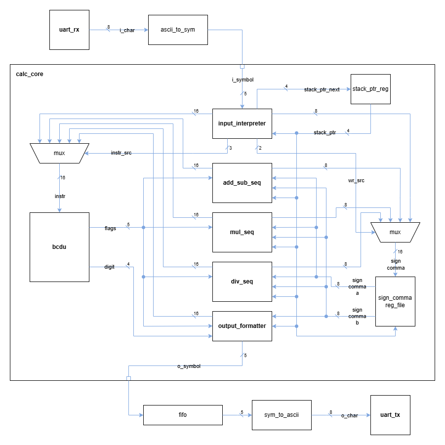
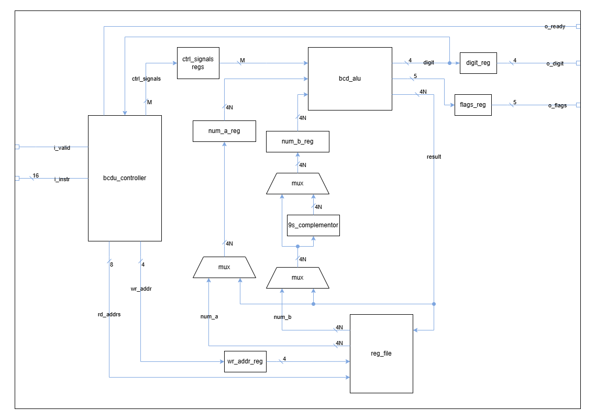
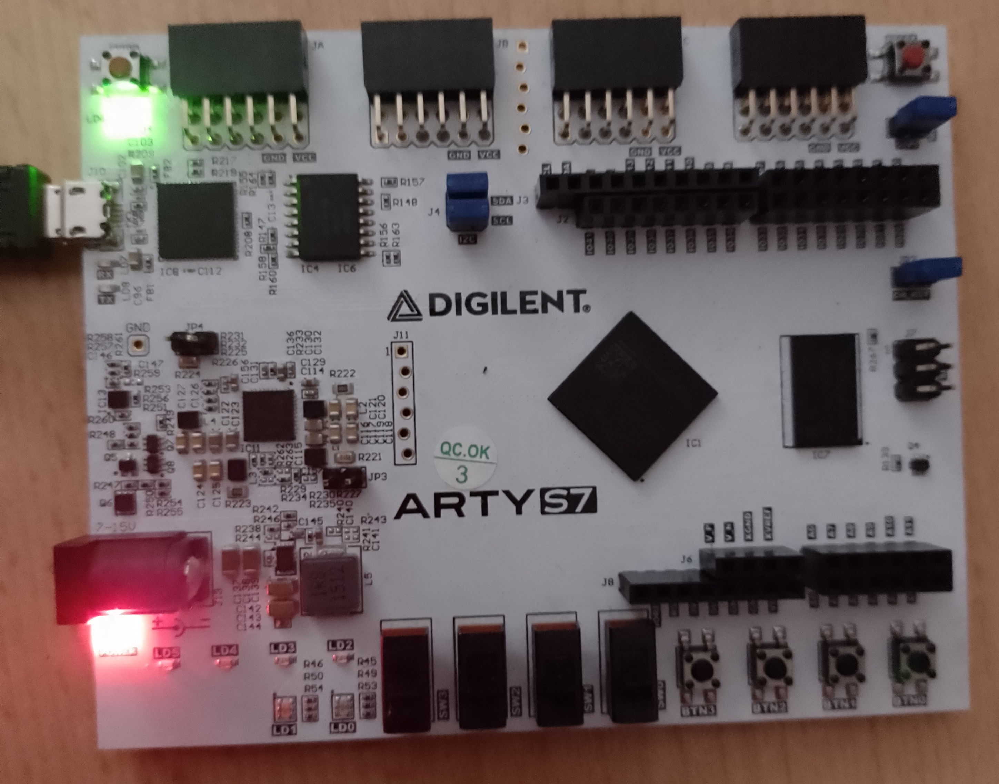
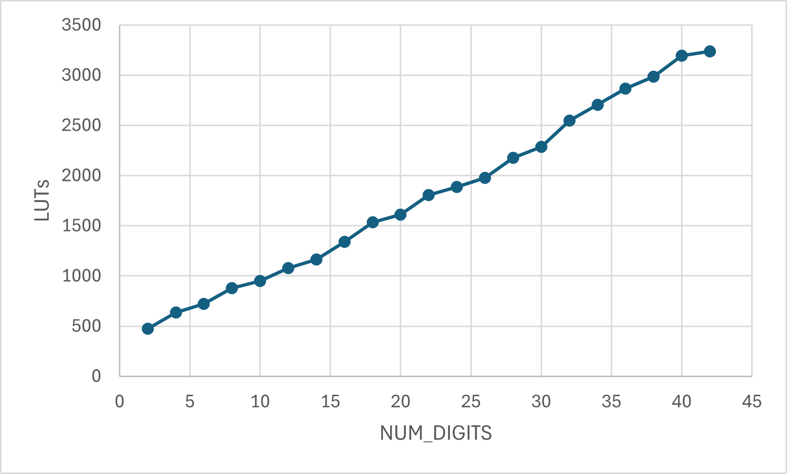
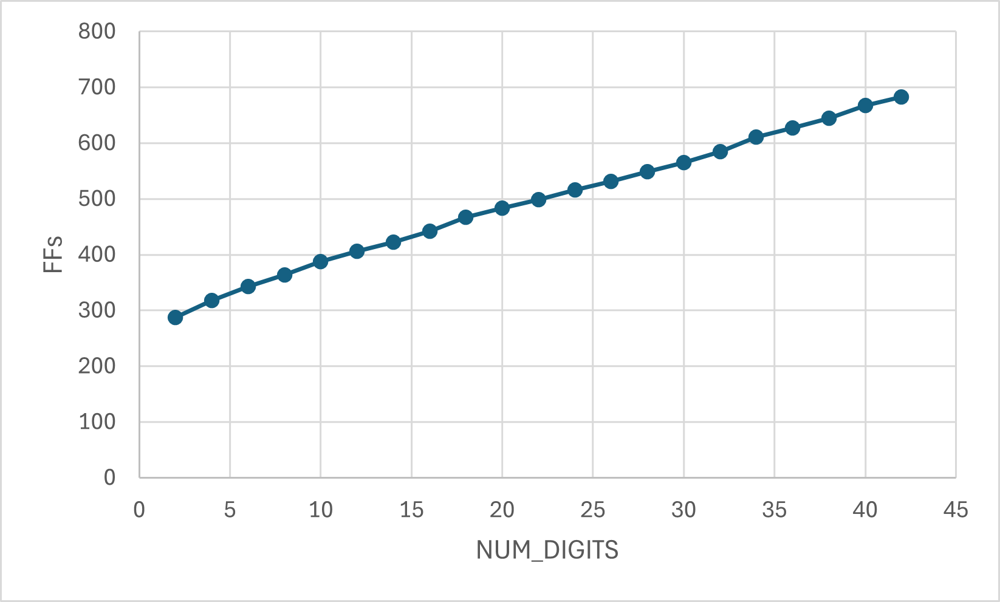
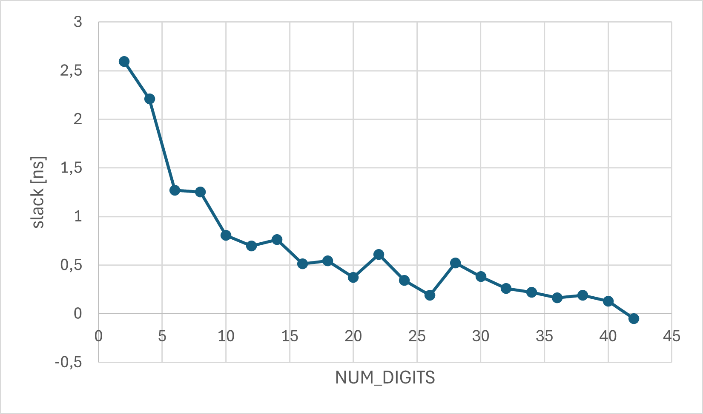
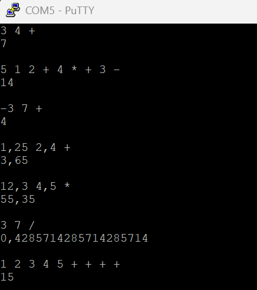

# RPN Decimal Calculator (FPGA)

## Overview

This project implements a configurable decimal arithmetic calculator written in Verilog and deployed on an FPGA.  
The system evaluates arithmetic expressions written in Reverse Polish Notation (RPN) and communicates with the user via a UART interface.

The design prioritizes computational accuracy and efficient hardware resource utilization, trading off execution speed.

The core of the system is a **BCD Arithmetic Unit (BCDU)**, which acts as a small specialized processor for decimal arithmetic.  
It contains an ALU, control unit, and register file, and executes arithmetic operations using a microinstruction-based execution model.

Arithmetic operations such as addition, subtraction, multiplication, and division are implemented as sequences of microinstructions generated by dedicated operation sequencers.

---

## Features

- Decimal floating-point arithmetic using BCD digits
- Reverse Polish Notation (RPN) expression evaluation
- Microinstruction-driven execution
- Dedicated operation sequencers for arithmetic operations
- Pipelined arithmetic execution
- Configurable number of digits
- UART communication interface
- FPGA implementation

---

## System Architecture

The system accepts arithmetic expressions via UART using Reverse Polish Notation.

Operands are stored in a **register file located inside the BCDU**.  
Although implemented as a register file, it is addressed in a way that allows it to behave similarly to a stack structure required for RPN evaluation.



Main components:

- UART interface
- RPN input interpreter
- output formatter
- operation sequencers
- BCD Arithmetic Unit (BCDU)

---

## BCD Arithmetic Unit (BCDU)

The **BCD Arithmetic Unit (BCDU)** is the execution core of the system.

Conceptually, it behaves like a small microprogrammed processor specialized for decimal arithmetic.  
It integrates the following components:

- BCD ALU
- control unit
- operand register file



Arithmetic operations are executed through sequences of microinstructions that control the internal datapath.  
The BCDU features a **3-stage pipeline**: instruction decode, ALU execution, and writeback to the register file.

This architecture allows multiple operations to share the same arithmetic hardware, significantly reducing FPGA resource usage compared to designs that implement separate datapaths for each operation.

---

## Operation Sequencers

Each arithmetic operation is implemented by a dedicated **operation sequencer**:

- addition/subtraction sequencer
- multiplication sequencer
- division sequencer

These sequencers generate sequences of microinstructions that control the BCDU execution unit.

This design separates **operation-level control logic** from the **arithmetic execution hardware**, improving modularity and making the system easier to extend.

---

## FPGA Implementation / Simulation

### Simulation

- **Simulator:** Icarus Verilog  
- **Run all testbenches:**  

```bash
make
```

This compiles all Verilog sources and runs the simulations automatically.

### Build and Programming

The FPGA project is built and programmed using the Vivado script `run_vivado.sh`:

- **Build only:**  

```bash
./run_vivado.sh -b
```

- **Program only:**  

```bash
./run_vivado.sh -p
```

- **Build and program in one step:**  

```bash
./run_vivado.sh -bp
```

### FPGA Target Platform

- **Board:** Digilent Arty S7  
- **Toolchain:** Vivado  

The system communicates with the user via a UART interface, allowing arithmetic expressions to be entered and evaluated directly on the FPGA.



---

## Resource Utilization and Timing Analysis

The project includes an analysis of FPGA resource utilization and timing characteristics depending on the number of digits used in operands.

Increasing the number of digits increases the critical path length in the arithmetic datapath, eventually leading to negative slack for sufficiently large configurations.

### LUT utilization:



### FF utilization:



### Timing Slack analysis:



---

## Example Usage

The figure below shows sample RPN expressions entered via UART and the resulting outputs displayed by the system.


